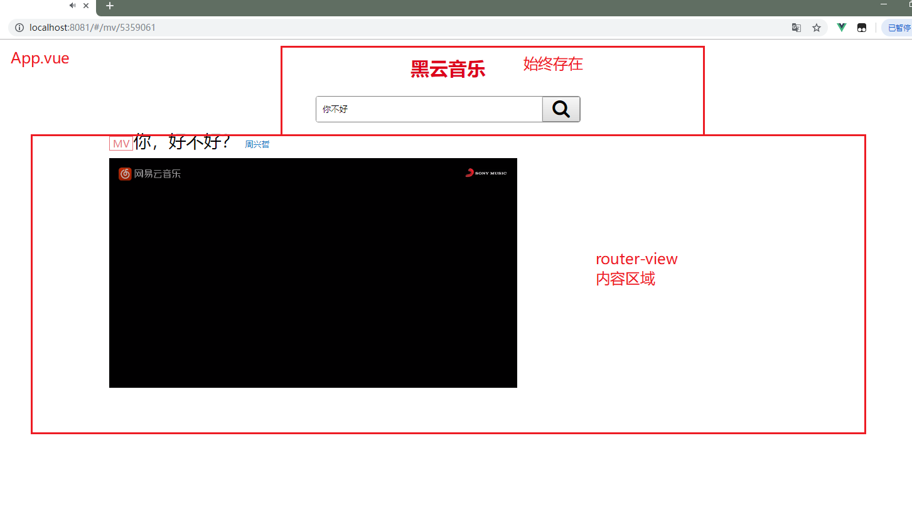
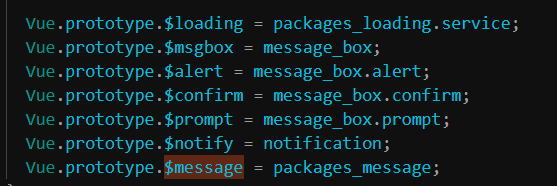

# Vue框架学习 - 第6天

## 昨日反馈

| ***  | 意见或建议                                                   |
| ---- | ------------------------------------------------------------ |
| ***  | 感觉vue没什么好学了,好没意思啊,老师分别在即打套军体拳呗**（Vue基础确实就这么些知识，坦白说，能够听到你说“没什么好学了”这句话呢，我是既高兴又不高兴，高兴在于你应该是get到了vue的核心了，不高兴在于怕你放弃这种初心，不再努力，止步不前！至于，军体拳？？？？你看我这身形还能打军体拳？这事得找你们班长比较好！他还好，还没有走形！）** |
| ***  | 今天似乎找回了一点自信哟**（嗯， 不错，其实第4天的时候切换这种模块思维，确实还是很有压力的，我一直告诉大家，不要着急哦，一步一步来，自然就能get到这些点，就能解决问题！这个点是什么点呢？数据驱动、工程化、模块化思维！没错就是这些！）** |
| ***  | 喝岩浆嘛**（此处应该反手！）**                               |
| ***  | 早上好呀，**（你好，我好，大家好！）**                       |
| ***  | 大家都在写明天的代码，自己想多敲两遍今天的，但是敲完第二次感觉又挺简单觉得没有必要，这个时候应该预习还是坚持多来两次**（我觉得这个都可以，天下呢，没有白来的爱，Vue说难不难，说简单呢，也不是太简单，一句话，只要你在努力撸代码的过程中，我觉得都是在前进的路上！相信你一定能够成功！加油！）** |
| ***  | 还行**（这么精炼的评论！为师get不到你的点啊！你这是评价我呢？还是评价vue呢？还是评价你自己学习的情况呢？还是...）** |
| ***  | 写项目很有意思的。贺老师讲的很有意思，有点舍不得啊。**（哎，我也舍不得你啊！可是，天下大势，分久必合，合久必分啊！江湖很大，我们还有很多相见的机会和缘分滴！很荣幸，也非常开心能够带领大学学习Vue基础！）** |
| ***  | 老师一吼,我们在角落瑟瑟发抖.老师你带我们时间比较短,我们每天早上前一两节课,精神状态大多数都不咋样,困的不行!所以老师你在上面问问题的时候,下面雅雀无声,其实是都是眼睛睁着大大的,大脑在休眠,这是一种保护机制.所以老师你也不用太恼火.冷静,一定要冷静~~~或者像其他老师一样,中间穿插一点人生阅历,心灵鸡汤,`荤段子`,我们一下子就活了.我们最喜欢听老师讲他们工作中遇到的事了**（哈哈，你这小子，恼火呢，更多是做给你们看滴，老师要是没点脾气，嘿，你们这群小兔崽子还不放任自流了？？？反正是最后一天了，摊牌了，没错我就是摊牌了，睡觉呢，我也不管了！反正，睡的我发火了，反手！关于这个工作分享啊，这个也是看情况的，有些同学想多听听，有些同学呢，不爱听，第二天的时候跟大家分享了一些自己的感悟，这个有些同学就反馈说不想听，后面想想，就没有再多分享了，毕竟你再投诉我一个上课吹牛不讲课，那我就很尴尬了！哈哈，今天的课程压力不大，对大家来说基本上都是小菜一碟了，中间有几个彩蛋，分享分享！最后一天咯，42期给我的印象很深啊！你们很聪明也很努力，一点不恭维，这个班是我带的超级喜欢的一个班级！）** |


## 课程回顾

昨天咱们学习了使用一个新的**工程化、模块化**的工具来开发项目，叫做vue-cli，也叫做vue脚手架工具，我们先回忆一下，脚手架是如何安装和运行起来的？

> 1.  单文件组件的组成
>     1.  模板结构
>     2.  脚本逻辑
>     3.  页面样式
> 2.  vue-cli(脚手架)
>     1.  把很多开发中需要用到的功能整合到了一起
>     2.  让vue的开发人员直接专注于逻辑代码即可
>     3.  webpack配置出来的
> 3.  创建项目
>     1.  `vue created 项目名`项目名不能中文，不能大写
>     2.  项目创建不好，用别人创建好的，自己npm i
> 4.  运行项目
>     1.  小黑窗进入项目文件夹 cd 
>     2.  `npm run serve` "yarn serve"
> 5.  vue-cli创建的项目
>     1.  下包怎么下`npm i 模块名`
>     2.  如何导包`import 名字 from '模块名'`
> 6.  整合路由
>     1.  组件新建一个文件
>     2.  路由的设置`main.js`，注意设置路由重定向`redirect`
>     3.  App.vue router-link router-view


##今日课程目标

> 同学们,咱们昨天,基于vue-cli脚手架,学习的“黑云播放器”开发,完成了搜索组件引入、路由整合基础功能，后面的相关功能还需要慢慢开发。今天我们学习新的知识，并且来逐步优化完成一个完整的播放器，涉及到新的知识点主要包含以下几个方面：

- 能够把饿了么ui整合到项目中
- 能够使用饿了么ui的轮播图
- 能够使用饿了么ui的弹框
- 能够把axios抽取到vue的原型中
- 能够设置axios的基地址
- 能够使用侦听器检测$route的数据更改


## 云听播放器 - 新界面分析

> 1. 相对于之前咱们做的黑云播放器功能大同小异，基本核心功能是一致的，搜歌、放歌、mv、评论。
> 2. 多了一个轮播器
> 3. 输入非空判断、弹窗提醒等小细节也做了优化




## 云听播放器 - 轮播图组件整合

> 1. 创建轮播图组件 05.slider.vue
> 2. main.js中导入组件并注册到路由实例上去
>    1. path:"/slider"
>    2. component:slider
> 3. 需要注意，添加了路由规则之后，可以用router-link,或者router.push来修改地址。但是，更直接的方法，我们可以直接修改url地址即可


##饿了么UI 介绍

> 1. 现在咱们的轮播图组件已经注册了，现在我们来实现这个组件，给大家介绍一个现在比较流行的框架库 饿了么UI，[官方地址](https://element.eleme.cn/#/zh-CN)
> 2. 饿了么前端团队开发的PC端的基于vue的组件库，移动端使用的是mint-UI，
> 3. 内部封装了很多现成的组件，直接就可以使用比如轮播图，tab栏，省市联动，开关，table
> 4. 因为在vue开发时用的很多，所以和几个其他的库合并到一起被称之为 **vue全家桶**
>    1. vue
>    2. axios
>    3. vue-router
>    4. 饿了么UI
>    5. vuex
> 5. 接下来我们来使用饿了么UI，并引入其轮播图（走马灯）组件


##云听播放器 - 使用轮播图

> 1. 导包和用包我们的饿了么UI组件
>    1. 下包 npm i element-ui -S
>    2. 导包 [官方文档](https://element.eleme.cn/#/zh-CN/component/quickstart)
>    3. 使用组件
>       1. 找到你要的组件 找到你要的结构
>       2. c+v
>       3. 走马灯 组件
>    
> 2. 使用axios获取网易云音乐轮播图，https://autumnfish.cn/banner，axios下包、导包、用包，获取到对应的数据
>    1. 安装axios npm i axios -S
>    3. 在created生命周期钩子中调用获取数据
>    4. 请求数据成功后，渲染到页面上
>    
>    ``````js
>    // 饿了么ui相关
>    // 导入饿了么ui 库
>    import ElementUI from 'element-ui'
>    // 导入 饿了么ui的样式
>    import 'element-ui/lib/theme-chalk/index.css'
>    // use一下
>    Vue.use(ElementUI)
>    
>    // 整合axios 
>    import axios from 'axios'
>    // 设置基地址
>    axios.defaults.baseURL = 'https://autumnfish.cn';
>    // 把axios设置给Vue的原型
>    Vue.prototype.$axios = axios 
>    ``````
>    
>    ``````html
>    <!-- 饿了么ui的轮播图组件 -->
>    <el-carousel height="400px" class='my-carousel'>
>       <el-carousel-item v-for="(item,index) in sliders" :key="index">
>         
>       </el-carousel-item>
>    </el-carousel>
>    ``````


## 云听播放器 - 歌曲搜索实现路由切换

> 1. 在01.search.vue组件内部，点击搜索，或者按下回车时，我们使用编程式导航（类似window.location）跳转到对应的路由地址，这个路由地址定义的是：path:'/results/:search'
>2. 我们之前是这样调用的：`this.$router.push('/results/搜索关键字')`，运行确是失败的？！为什么呢？因为我们拿不到router这个对象了，我们该如何拿到这个router对象呢？
> 3. 在组件中使用编程式导航，this.$router.push('地址')
> 


## 云听播放器 - 搜索结果非空判断

> 1. 现在我们从输入搜索关键字的地方开始，进一步整合我们前面学习到的知识点，首先打开  01.search.vue 组件
> 2. 点击搜索，或者是按下回车
> 3. 判断搜索关键字是否为空
>    1. 不为空跳转
>    2. 为空，使用element弹窗提示用户


##饿了么UI 弹框插件

> 1. 前面咱们学习了饿了么UI的轮播图（走马灯）插件，这一节课咱们学习一个新的插件 -  弹框插件，[官网地址](https://element.eleme.cn/#/zh-CN/component/message)
>
> 2. 使用方式`  this.$message('这是一条消息提示'); `
>
> 3. 为什么可以使用this来直接调用？element-ui/lib/element-ui-comment.js，搜索关键字 $message，我们可以看到是这些都直接加到了vue原型上面，直接可以使用，具体查看目标文件是：
>
>    
>
> 4. 需要弹框的时候，调用上述的代码，即可弹出一个普通的消息提示框
>
> 5. 如果要弹出一些比较高级的框，需要使用以下方式进行调用

```js
this.$message({
  message: '恭喜你，这是一条成功消息',
  type: 'success'
});
this.$message({
  message: '警告哦，这是一条警告消息',
  type: 'warning'
});
this.$message.error('错了哦，这是一条错误消息');
```


##云听播放器 - 渲染搜索结果

> 1. 通过路由获取数据
> 2. axios调用接口
>    1. 在created生命周期钩子函数中调用接口
>    2. 使用地址是： https://autumnfish.cn/search?keywords=搜索关键字（咱们已经设置了基地址，所以，可以直接拼接即可）
>    3. 可以将基础地址
> 3. 数据获取到之后
> 4. 渲染到页面上
> 5. 需要注意：created 一般情况下都是用来获取初始的数据 
>


##云听播放器 - 使用过滤器处理数据

> 1. 使用过滤器出来歌手信息，filters:formatSinger(singers)\{ return}
> 2. 使用过滤器处理时间，filters:formatTIme(time){ return}
> 3. 定义和用法类似，但是内部的逻辑需要根据需求来调整


##云听播放器 - 搜索刷新功能实现

> 1.  现在我们已经实现了，输入框搜索后获得歌曲列表的效果，但是，现在大家看一下，我这边再输入一个新的数据，点击回车，我们发现路由变化了，但是数据却没有被请求，也没有发生变化，而我们刷新页面后才会有新的反应，这个是为什么呢？
> 2.  我们现在去看一下，我们当初是如何发送的请求，我们在created钩子函数中定义的发送数据请求，现在我们在**当前路由**下面，再次更改数据后，这个搜索组件路由已经存在了，created却只会被调用一次，所以，就无法获取新的数据了，对吧？
> 3.  需要注意的是：从其他路由切过来，搜索列表组件路由被调用的时候会调用created钩子函数，但是，就在搜索列表组件路由内部更新关键字，这个时候再点击回车就没有效果了
> 4.  我们现在期望的目标是：检测指定的数据改变，执行自定义的逻辑，大家觉得该怎么做呢？是不是监听 `$route`内部的数据变化就可以了？用咱们之前学习到的知识，是不是可以使用updated钩子函数来执行？但是并不合理，因为在updated钩子函数中，监听的是整个data内部的属性变化。
> 5.  当然，实在不行就刷新整个页面，手动设置刷新一次就可以了：window.location.reload() 即可，但是，这种解决方案很low，有没有更好的解决方案呢？有，使用侦听器来监听输入的这个数据


## 使用侦听器（watch）检测$route的数据更改

>   watch，它有一个比较牛逼的名字侦听器，使用方法很简单`watch:{  数据名(){} }`，watch到底是什么呢？
>
>   1.  watch的作用是观察data中的特定数据改变，添加自定义的逻辑
>   2.  要观察那个数据，就写哪个数据的名字即可
>   3.  可以传入两个参数，`newVal, oldVal`
>   4.  updated，只要**任何数据改变**都会触发，watch只在**特定数据改变时**触发
>   5.  我们在这里需要监听的是results组件内部，路由的参数发生变化就自动触发更新重新请求歌曲列表
>
>   ```````js
>   '$route.params.keyworld':function（newVal, oldVal）{
>   
>   }
>   ```````
>
>   


##云听播放器 - 播放歌曲功能实现

> 1. 构建播放器组件路由及调用
>    1. 在03.results.vue的歌曲列表的 左侧播放按钮上绑定 点击事件
>    2. 点击事件中获取歌曲的id
>    3. 触发之后，使用编程式导航跳转去播放器 放歌，携带id
>    4. 动态路由匹配 main.js
>       1. 创建`04.player.vue`组件
>       2. `path:'/player/:id'`
>       3. `component:player`
>    5. 完善播放器功能
> 2. 在vue基地址上设置axios全局变量，并设置基地址
>    1. main.js中 把axios设置给 `Vue.prototype.$axios=axios`，使用编码规范\$作为前缀区分，这是一个大家都遵守的约定
>    2. 设置以后，所有的组件内部都可以使用`this.$axios`直接使用
>    3. 基础地址一样，没有必要每次都写，可以直接抽取出来，这样的话在每次调用的时候就不需要写一大串了：`axios.defaults.baseURL = '设置的基地址';`
> 3. 重点知识点深化回顾
>    1. $的目的是和自己的属性区分，这是一个大伙都遵守的约定 
>    2. 设置了之后，所有的组件内部都可以通过`this.$axios`访问axios
>    3. axios设置了基地址之后，请求有2种情况
>       1. 请求的地址如果是包含http的完整地址，比如：https://autumnfish.cn/song/search?id=123，这个时候axios不会去拼接基地址
>       2. 如果请求的地址只有一部分：`/song/url?id=123`，axios就会自动补全基地址部分
>    4. 绝大多数的项目中，后台接口部署在一台服务器上，基地址是一样的，设置一次即可，对于不同基地址的接口，直接给完整地址
>    5. 在实际项目中很少出现请求多个服务器地址的情况，因为后台小伙伴会进行整合和管理
> 4. 歌曲信息显示，created中 调用 歌曲url接口
> 5. 歌曲url获取created中 调用歌曲封面接口
> 6. 歌词显示，created中 调用歌词接口即可，处理歌词用的正则表达式进行替换过滤即可：`/\[\d{2}\:\d{2}\.\d{2,3}\]/`


## 云听播放器 - 歌曲评论功能实现

> 1. 歌曲评论路由设置
>
>    1. 新建组件 05.comment.vue
>    2. 在main.js 设置路由规则 path:/comment/:id
>    3. 在组件路由中引用 component:comment
>
> 2. 点击携带歌曲id去评论组件
>
>    1. 在 04.player.vue组件中,为歌名 绑定点击或者双击事件( dblclick )
>    2. 编程式导航`this.\$router.push('/comment/${id}')`
>    3. 引用的时候需要注意静态文件的路径问题，根据需求找到设置的文件即可
>
> 3. 获取评论信息
>
>    1. created获取评论信息 /comment/hot?id=186016&type=0 
>    2. then方法中
>    3. data中加数据
>    4. 页面中写vue指令 渲染
>
> 4. 格式化评论时间
>
>    1. 下载moment.js   npm i moment -S
>
>    2. 导入 import moment from 'moment'
>
>    3. 在 05.comment.vue 组件中添加一个过滤器
>
>       ``````js
>       filters:{  formatTime(time){ 
>       	return moment(time).format('YYYY年MM月DD日 HH:mm:ss')
>       } }
>       ``````
>
>    4. 在页面中使用{{ 数据 |过滤器}}
>
>    5. 时间的处理，第一时间想到moment这个库


## 云听播放器 - mv播放

> 1. mv路由设置 
>    1. 新建06.mv.vue
>    2. path:"/mv/:mvid"
>    3. component:mv
> 2. 点击携带mvid去mv组件
>    1. 在04.results.vue中 为mv的图标绑定点击事件 传入id
>    2. 使用编程式导航跳转
>    3. this.\$router.push('/mv/${id}')
> 3. 获取mv信息 
>    1. 在created中调用接口 
>    2. 获取数据使用短链接  /mv/detail?mvid=5436712 
> 4. 播放最高清的mv，then中获取清晰度最高的mv进行播放
> 5. Tag：对象的属性获取可以用点语法也可以中括号的语法，都可以获取到对应的属性数据


------


##云听播放器 - 播放器优化

> 1. 统一设置宽度
>    1. App.vue中
>    2. 把router-view包在盒子里
>    3. 为这个盒子设置尺寸即可
> 2. 设置平滑滚动
>    1. iScroll很流行的滚动库，但是已经不更新了
>    2. better-scroll [更好的滚动库](https://www.npmjs.com/package/better-scroll)
>       1. 下包 npm i better-scroll 
>       2. 导包 import BScroll from 'better-scroll'
>       3. 用包
>          1. 先在外围使用 const scroll = new BScroll('.类选择器')，发现失败了
>          2. 引入mounted钩子，最早获取dom元素的位置
>          3. 设置超出隐藏，实现滚动结果
>       4. 准备结构
>       5. 用包
> 3. 重点知识回顾
>    1. 获取dom元素最早在mounted中 ref 
>    2. 更美观的滚动效果，工作中偶尔会碰到
>       1. iScroll
>       2. better-scroll(推荐)
>       3. 单纯的滚动库
>    3. 为了实现滚动效果，
>       1. 3层盒子
>          1. 容器
>          2. 内容容器
>          3. 内容
>       2. 容器的高度必须写死，内容超过了容器之后，自动滚动


##侦听器watch深度侦听（拓展）

> 1. 同学们咱们前面学习了侦听器来侦听数据的改变，并执行相应的逻辑。现在我们来对一个对象，只修改其中一个值，这个时候我们监听这个对象会发现并没有调用侦听器，这是为什么呢？
>
> 2. 这是因为在侦听器里面传入的两个参数，oldVal和newVal保存的都是这个数组对象的索引值，前面同学们学过基础数据类型和复杂数据类型，还记得哪些是原始基础数据类型，哪些是对象数据类型吗？
>
>    1. 原始类型
>       1. 基础类型，修改直接修改内容本身：var a = 1,  b = 1;　a == b;   //true
>       2. 详细分类
>          1. 数字（number）
>          2. 字符串（string）
>          3. 布尔值（boolean）
>          4. null
>          5. undefined
>    2. 对象类型
>       1. 对象是可变的，即值是可以修改的对象的比较并非值得比较
>       2. 比如：var a = [], b = [];a == b;   //false，只有在引用相同时，两个只才会相等
>       3. 特殊对象--数组（array），特殊对象--函数（function），object类型
>
> 3. 而watch对复杂数据类型，只能监测其是否来自于同一个`引用`，进而无法实现真正监测的目的，那么我们该怎么做呢？watch给我们提供了一个方法，叫`深度侦听`
>
>    1. deep:true
>    2. 执行的方法是handler
>    3. 2个参数都是相同的内存地址，值一样（复杂数据类型）
>
>    ```js
>     // 侦听复杂类型数据的时候，传入的参数，是数据的内存地址
>          // 2个参数的值是一样的
>          // 基本数据类型2个参数是不同的
>          // 复杂类型无法通过2个参数进行对比
>          food: {
>            handler(newVal, oldVal) {
>              console.log(newVal)
>              console.log(oldVal)
>            },
>            // 开启深度侦听
>            deep: true
>          }
>    ```

> PS：侦听器是面试最常见的问题之一，面试官一般会问：侦听器用过吗？Vue中你碰到了什么坑?你应该怎么答比较好呢？
>
> 1. 侦听器，我当时用它来检测数据的改变，执行自定义的逻辑，
> 2. 实现了路由信息改变之后，重新获取数据--搜索页面做的
> 3. 后续有类似的需求也用侦听器挺不错的
> 4. 碰到了一个坑点，复杂类型的侦听，
>    1. 必须要开启深度侦听，才可以检测到内部数据的改变
>    2. 开启深度侦听之后，2个参数给我的值都相同，我本来还想作比较的
> 5. 侦听的时候，精确到对象的属性名就可以避免这个问题了！
> 6. 其实在数据改变时，用updated这个钩子也可以，但是触发的频率比侦听器高
> 7. 除了updated钩子，我还用过这些钩子，比如
>    1. mounted
>    2. created
>       1. axios数据获取
>       2. 抽取axios


## 过滤器补充（拓展）

> 1. 前面我们学习过一个新的知识点，叫做过滤器的基础使用，大家回忆一下，过滤器 filters 的实现过程？
>
>    1. 定义的方式，vue中直接定义 filters : {}
>    2. 一个过滤器一个方法
>    3. 使用的使用`{{ 数据 | 过滤器 }}`
>    4. 过滤器需要接收一个参数，参数就是处理的数据
>    5. 内部处理完毕之后 return 新的值，页面会显示 返回出来的新值
>    6. 不会修改原始值
>
> 2. 今天，我们学习filters的一些高级的功能，首先我们来看一个交流社区：[过滤器中的使用 this 是 undefined](https://github.com/vuejs/vue/issues/5998)，那么如果我们希望在过滤器中使用我们定义好的上下文data数据怎么办？ok，接下来我们学习filters的一个新的特性，叫做过滤器传参
>
>    1. 调用过滤器是，和调用方法类似，传入参数即可
>
>    ```html
>    <h2>过滤器的传参</h2>
>    <p>{{ food | cookFood('爆炒')}}</p>
>    <p>{{ food | cookFood('清蒸')}}</p>
>    <p>{{ food | cookFoodPlus('清蒸','红烧')}}</p>
>    ```
>
>    2. 定义过滤器时
>
>    ```js
>    // 处理food的过滤器
>      cookFood(foodName, do1) {
>        return foodName + do1
>      },
>      // 高级烹饪
>      cookFoodPlus(foodName, do1, do2) {
>        return foodName + do1 + do2
>      }
>    ```
>
>    3. 自己传入的参数，从第二个开始，第一个参数固定是，处理的数据
>
> 3. 现在，假如我们定义了两个过滤器，如果对一个结果这两个过滤器都要调用该怎么处理？过滤器给我们提供了一个牛逼的特性，叫过滤器的串联，也可以叫管道链式调用
>
>    依次写一堆过滤器即可` <h2>{{ info | addFont | addBack | addBack2 }}</h2> `
>
>    ```js
>    filters: {
>          addFont(value) {
>            return '唱,' + value
>          },
>          addBack(value) {
>            return value + ',rap'
>          },
>          addBack2(value) {
>            return value + ',打篮球'
>          }
>        }
>    ```
>
> 5. 还有，一种可能，我现在定义了一个过滤器，我需要在所有的组件中都可以被调用，我们该如何处理？ok，接下来我们来对比学习两种过滤器定义的方式：全局定义和局部定义
>   1. 定义一次
>    2. 所有地方都可以用
>   3. 如下语法 即可定义全局过滤器
>    4. 第二个参数是函数，如果要传参和上面写法一样
> 
> ```js
> Vue.filter('cookFoodPro', (value)=>{
>        return value+'削皮，切碎，爆炒，油炸，装盘，美滋滋！！！'
>      })
>    ```
>    
>    		5. 全局过滤器的定义一定要放在实例化Vue`new Vue`的前面，否则不会生效
>  		6. 局部过滤器
>   		7. 定义一次，只在当前这个Vue实例中可以使用（组件）
>  		8. 实例内部的`filters` 局部过滤器


## 今日目标回望

- 能够把饿了么ui整合到项目中
- 能够使用饿了么ui的轮播图  
- 能够使用饿了么ui的弹框  
- 能够把axios抽取到vue的原型中
- 能够设置axios的基地址
- 能够使用侦听器检测$route的数据更改


